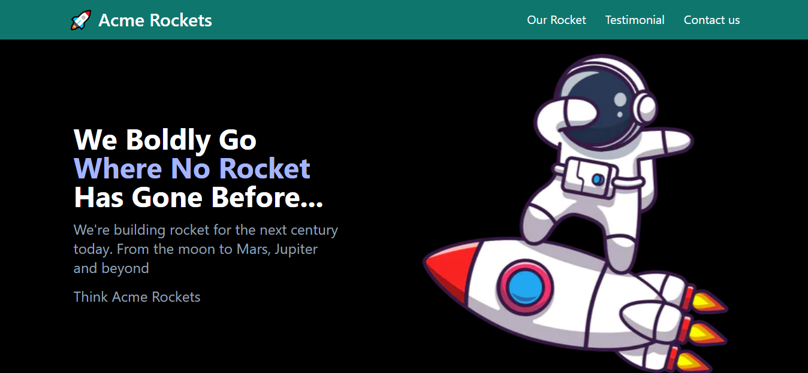
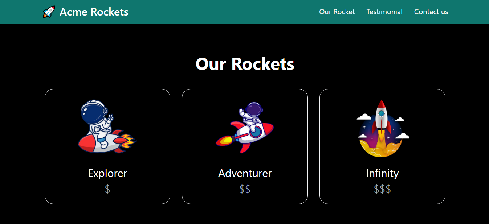
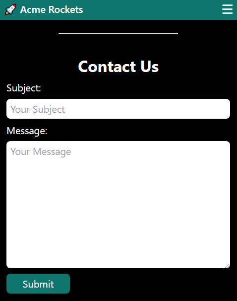
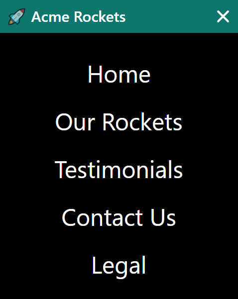

### Portfolio Web App

###  https://tailwind-css-navy.vercel.app/

## Images

## Mobile Responsive

## Run Locally

- Run this command `https://github.com/aliaftabsheikh/tailwind-css.git`
- You are now in the dev environment and you can play around

## Tech Stack

- HTML5
- Tailwindcss
- Javascript
- Next js

## How we Learn

- Next.js Functional components and their reusability
- File and folder structure
- Fundamental of tailwind css properties and master flex & grid
- Fundamentals of the custom animations and media queries
- Next.js app directory and his layout structure
- And at the end we will learn how to deploy your websites at Vercel